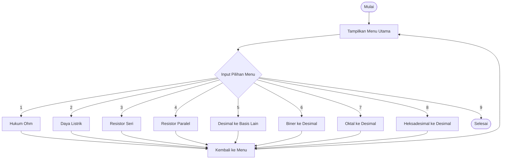
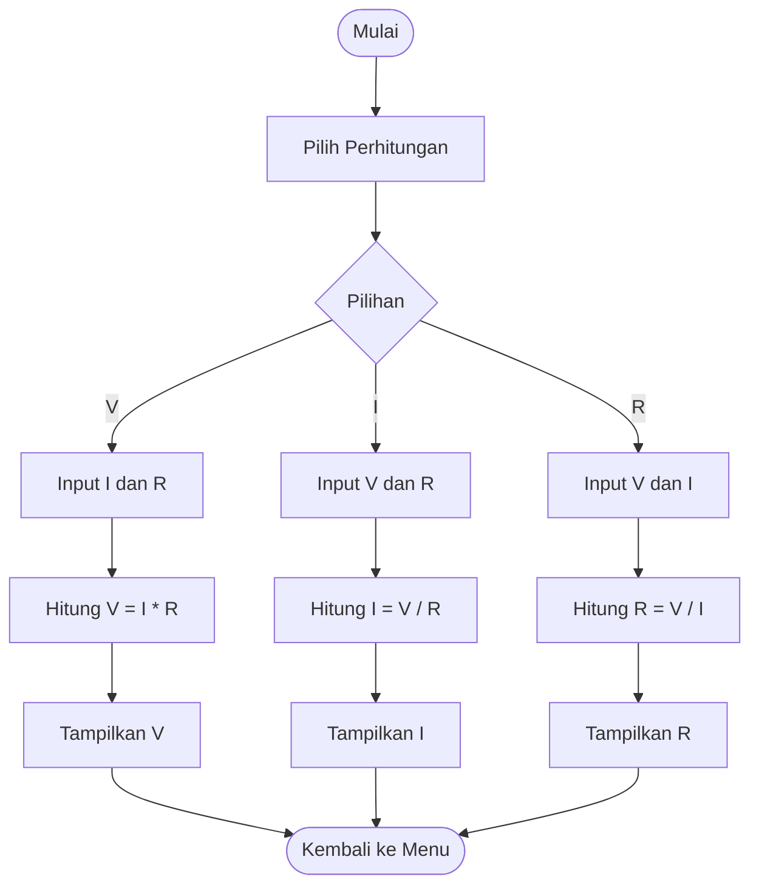
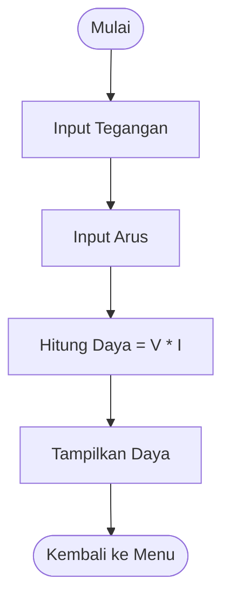
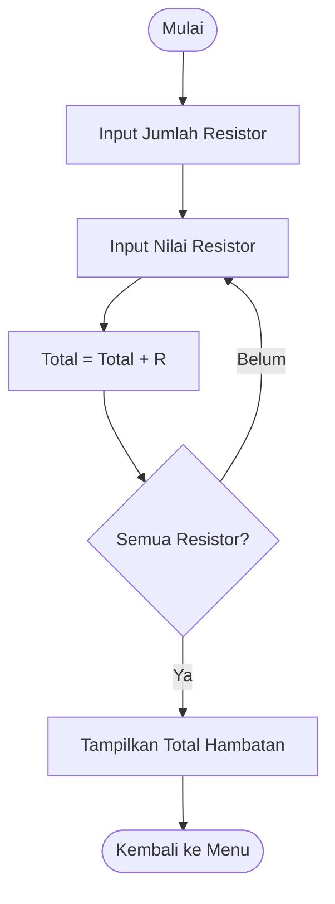
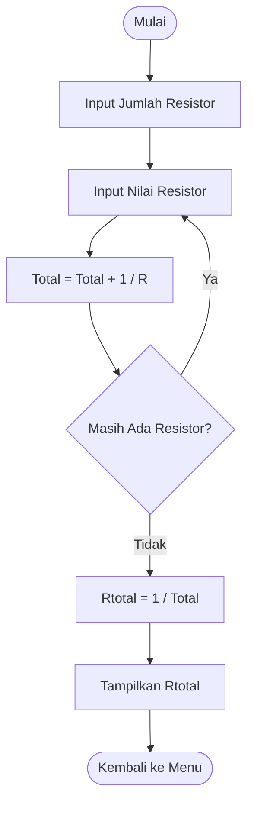
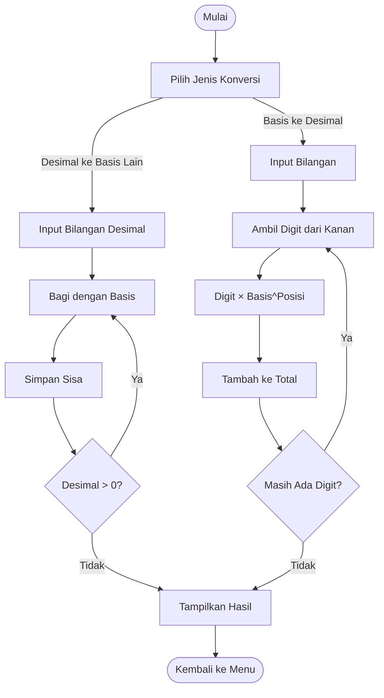

# Toolkit Asisten Laboratorium Elektro (C)

## Deskripsi Program

Program **Toolkit Asisten Laboratorium Elektro** adalah aplikasi berbasis bahasa pemograman C yang digunakan untuk membantu praktikan dan asisten laboratorium dalam melakukan verifikasi cepat perhitungan dasar pada mata kuliah **Dasar Rangkaian Elektrik** dan **Sistem Digital**.

---

## Identitas Kelompok

- **Program Studi**: Teknik Telekomunikasi  
- **Institusi**: Institut Teknologi Sepuluh Nopember (ITS)  

**Anggota Kelompok:**
1. Firyal Hasna Aqilah — NRP 5048251010  
2. Nabila Izzet Putri Ananta — NRP 5048251028  
3. Hasna Nurdiana — NRP 5048251056  

---

## Tujuan Program

Tujuan pembuatan program ini adalah:

* Memenuhi tugas mata kuliah Dasar Pemograman
* Membantu asisten laboratorium dalam melakukan pengecekan hasil perhitungan praktikan
* Menyediakan alat bantu perhitungan dasar rangkaian listrik DC
* Memahami konsep sistem bilangan (biner, oktal, heksadesimal)
* Melatih penerapan konsep pemrograman C seperti fungsi, percabangan, dan perulangan


---

## Fitur Program

### Verifikasi Rangkaian Elektrik

1. **Kalkulator Hukum Ohm**
   Menghitung Tegangan (V), Arus (I), atau Hambatan (R) berdasarkan dua besaran lainnya.

2. **Kalkulator Daya Listrik**
   Menghitung daya listrik menggunakan rumus:
   [ P = V \times I ]

3. **Kalkulator Resistor Seri**
   Menghitung total hambatan resistor yang disusun secara seri:
   [ R_{total} = R_1 + R_2 + \dots + R_n ]

4. **Kalkulator Resistor Paralel**
   Menghitung total hambatan resistor yang disusun secara paralel:
   [ R_{total} = \frac{1}{\frac{1}{R_1} + \frac{1}{R_2} + \dots + \frac{1}{R_n}} ]

---

### Utilitas Sistem Digital

5. **Konversi Desimal ke Biner, Oktal, dan Heksadesimal**
   Menggunakan metode sisa bagi.

6. **Konversi Biner ke Desimal**

7. **Konversi Oktal ke Desimal**

8. **Konversi Heksadesimal ke Desimal**
   Menggunakan metode nilai posisi.

---

## Struktur Program

Program ini disusun menggunakan beberapa fungsi utama, yaitu:

* **main()**
  Mengatur alur utama program, menampilkan menu, menerima input pengguna, serta memanggil fungsi sesuai menu yang dipilih.

* **konversiDariDesimal(int desimal, int basis)**
  Digunakan untuk mengonversi bilangan desimal ke basis lain (biner, oktal, atau heksadesimal) menggunakan perulangan dan operasi modulus.

* **konversiKeDesimal(char angka[], int basis)**
  Digunakan untuk mengonversi bilangan biner, oktal, atau heksadesimal ke desimal dengan memperhitungkan nilai posisi setiap digit.

Selain itu, program menggunakan:

* Percabangan **if - else if - else** untuk pemilihan menu
* Perulangan **do-while** untuk menjalankan menu berulang
* Perulangan **for** dan **while** untuk proses perhitungan

---

## Library yang Digunakan

```c
#include <stdio.h>   // Input dan output
#include <string.h>  // Manipulasi string
```
---

## Flowchart Program

### 1. Flowchart Utama (Main Program)


---

### 2. Flowchart Hukum Ohm


---

### 3. Flowchart Daya Listrik 


---

### 4. Flowchart Resistor Seri


---

### 5. Flowchart Resistor Paralel


---

### 6. Flowchart Konversi Bilangan


---

## Cara Menjalankan Program

1. Pastikan compiler bahasa C telah terpasang (misalnya GCC)
2. Simpan file program, misalnya dengan nama `toolkit.c`
3. Compile program menggunakan perintah:

   ```bash
   gcc toolkit.c -o toolkit
   ```
4. Jalankan program:

   ```bash
   ./toolkit
   ```
5. Pilih menu sesuai kebutuhan dengan memasukkan angka menu yang ada

---

## Contoh Penggunaan

**Konversi Oktal ke Desimal**

```
Input  : 77
Output : 63
```

**Konversi Desimal ke Heksadesimal**

```
Input  : 255
Output : FF
```

---

## Penutup

Program **Toolkit Asisten Laboratorium Elektro** diharapkan dapat menjadi alat bantu sederhana dalam kegiatan praktikum dan pembelajaran. Program ini juga menjadi sarana latihan penerapan konsep dasar pemrograman C.
Terima kasih.

---


